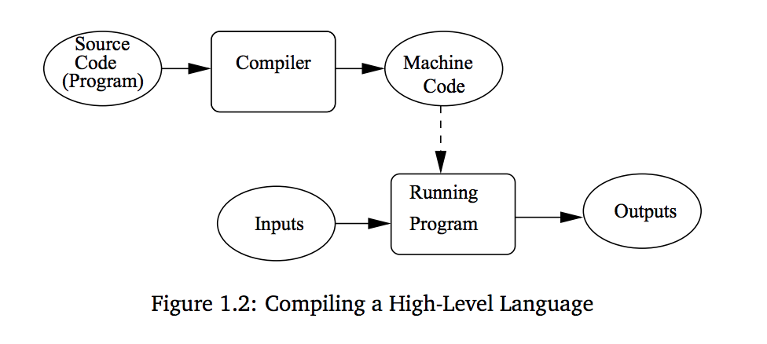
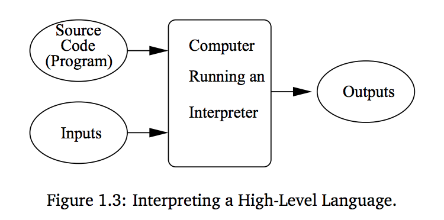

# Do At Least Two Everyday:
* Apply to one [job](https://www.indeed.com/jobs?q=full+stack+developer&l=San+Francisco%2C+CA)
* [Leetcode](https://leetcode.com/problemset/all/) problem
* Read 5 pages from a coding [Book](http://ce.sharif.edu/courses/96-97/2/ce153-4/resources/root/Text%20Books/An%20Introduction%20to%20Computer%20Science.pdf)
* Watch a conference [talk](https://www.dotconferences.com/conference/dotjs)
* Practice [pitch](https://docs.google.com/document/d/1b2WZysfhfLellMUBM3-a_c7rZNcJX-XrTo_jpJklLyw/edit)
* Go to [Noisebridge](https://www.meetup.com/noisebridge/events/) or [Sudoroom](https://sudoroom.org/calendar/) Event
* Get AWS [certified](https://acloud.guru/learn/aws-certified-solutions-architect-associate)

### Markdown Cheat [Sheet](https://github.com/adam-p/markdown-here/wiki/Markdown-Cheatsheet)

# May
## [X] 6/2/19 

#### Leetcode (2)
* isSelfDivisible [#728](https://leetcode.com/problems/self-dividing-numbers/) : **Completed**
   * Useful code block - Each digit of a number
   ```javascript
   const digitOfInt = (num) => {
    if (num === 0) return false;
    let curr = num;
    while (curr > 1) {
        let digit = Math.floor(curr % 10); 
        console.log(digit);
        curr /= 10;
        }
    }
    ```
* wordSubsets [#916](https://leetcode.com/problems/word-subsets/submissions/) : **Attempting**
    * Intializing a new variable with the values of an object will create a _reference_ to that object instead of a _copy_.
    ```javascript
    let x = {
        'a': 1;
        'b': 2;
    };

    let y = x;
    y['a']--; //this will actually change the values of variable x. 
              //y is currently referencing x, not a copy of it.
    ```
    * In ECMAScript 6, there is a `Object.assign` method that will create a _copy_ of an obj. Here's more [info.](https://stackoverflow.com/questions/728360/how-do-i-correctly-clone-a-javascript-object)
    ```javascript
    let y = Object.assign({},x);
    //Any changes to y will not affect the properties of x
    ```

    * **Summary:** The initial solution iterated through every value of B and checking for its occurence in the words of A.  This is _intractable_ because if letters are repeated in array B, then duplicate operations are made.

    ```javascript
    A = ["amazon","apple","facebook","google","leetcode"],
    B = ["ecc","oc","ceo"]

    //Output:
    ["facebook","leetcode"]
    ```

        A better solution would be to create a condensed array of length 26 (with each index representing a letter) and counting only the maximum orrurence of each individual sub set in B.  The reason we do this is because the largest subset check will control.

    ```javascript
    //if B = ['ecc','oc','ceo']
    B = [0,0,2,0,1,0,0,0,0,0,0,0,0,0,1,0,0,0,0,0,0,0,0,0,0,0,0]
    //       c   e                   o

    //if B = ['ooooo','e',arr]
    B = [1,0,0,0,1,0,0,0,0,0,0,0,0,0,5,0,0,2,0,0,0,0,0,0,0,0,0]
    //       c   e                   o     r
    ```

### Intro to Computer Science (1-5)

* 1.1 The Universal Machine
  * **Computer:**  a machine that stores and manipulate information under the control of a changeable program.
  * **Computer Program:** a detailed, step-by-step set of instructions telling a computer exactly what to do

* 1.2 Program Power
  * Programming develops the skill to analyze complex systems by reducing them into interactions of understandable subsystems

* 1.3 What is Computer Science?
  * The fundamental question of computer science is: _What can be computed?_
  * The three main techniques investigating this questions are: _design, analysis,_ and _experimentation_
  * **Algorithm:** a step-by-step process for achieving a desired result.
    * Some problems are not solvable by _any_ algorithm.  This is why mathematical _analysis_ of a problem is also use.
    * **Intractable Algorithms:** an algorithm that takes too long or requires too much memory to be of practical value.

* 1.4 Hardware Basics
  * **CPU:** central processing unit, the "brain" of the computer.  This is where all the basic operations of the computer is carried out.
  * **Main Memory (RAM or _Random Access Memory_):** The memory stores programs and data.  The CPU can only directly access information that is store in main memory.  Fast, but is volatile: _When the computer turns off, the memory is lost._  There must be a secondary memory that provides permanent storage.
  * **Hard Drive:** Is the secondary memory.


---
## [X] 6/3/19

### DotJS : [Revisiting `node_modules`](https://www.dotconferences.com/2018/11/mael-nison-revisiting-node-modules)

#####  `node_modules` Aren't Great 
  * There are a lot of I/O requirements for `node_modules` 
    * 30,000+ files required for a typical project, must be copied from the cache into the project folder
    * Impractical for the HTTP use case
    * Has negative runtime impact
  * Limiting factor in the optimization space : Impossible to fully optimize a dependency tree
    * Multiple versions of the same dependency could be used, path conflicts
    * Node will instantiate it twice
  * Permit unsafe accesses
    * Forgetting to list a package dependency in `package.json` won't necessarily break the program.  
    * This happens because of hoisting.
    
* What is the solution?
  * The Node resolution is to **make no assumptions**
    * Currently: `node_modules`
      * When a `require` call is made, node will ask it self over and over again: "Does this file exist? No? Look into the parent folder..." 
      * This will continue until the file is found.  Node deals purely with the files and directories
      * It knows nothing about the packages itself.
    * Instead: `.pnp.js`
      * yarn knows both about the packages and the independencies
      * Instead of generating a `node_modules` folder, we would generate a single javascript file: `.pnp.js` file.
      * It contains all the location of the packages on the disk and their dependencies.  Node will know exactly where to look for the packages by looking through the maps.  **No `require` calls are needed**
    * Results:
      * Faster installs in every case
      * Immediate installs across multiple projects
      * Strict safety mechanisms for ensure consistency
      * Enable tight integrations with the dependency tree
        * No risk that a project doesn't exist anymore.


### Leetcode(1)

* wordSubsets [#916](https://leetcode.com/problems/word-subsets/submissions/) : **Completed**
    * Useful code blocks 
        ```javascript
        // COUNT LETTERS OF A STRING
        const maxLetterCountOfStr = (arr)=>{
            const letterCount = new Array(26).fill(0); // each index represents the lowercase letters
            for(let i in arr){
                const a = "a".charCodeAt()
                let curr = arr[i].charCodeAt()
                letterCount[curr-a]++;
            }
            return letterCount
        }

        // COUNT MAX OCCURRENCE OF LETTERS OF A SET OF STRINGS

        const maxLetterCountOfSubset = (arr)=>{
        let result = new Array(26).fill(0);
        for(let i in arr){
            let letterCountOfStr = maxLetterCountOfStr(arr[i]);
            result = result.map((letter, i) => Math.max(letter, letterCountOfStr[i]));
        }
        return result;
        ```
    * This problem was very difficult as the input from Leetcode was had many repeating values.  First failure was due to timeout.  The algorithm would perform duplicate iterations.  This is not optimal but much better than before

    * When using map, make sure to initialze the results to a variable.
        ```javascript
        let x = [1,2,3,4,5];

        x.map(()=>9);
        // x = [1,2,3,4,5]

        x = x.map(()=>9);
        // x = [9,9,9,9,9]
        ```

### [Differences](https://www.activestate.com/blog/python-vs-java-duck-typing-parsing-whitespace-and-other-cool-differences/) and Similarities Between Python and Java

#### Similarities
* "Almost everything is an object" design
* compiled down to bytecodes that run on virtual machines.
* 

#### Differences
* Duck Typing
    * Java is statically types, Python is dynamically typed
    * Python: names in code are bound to strongly typed objects at runtime.  THe only condition on the type of objject a name refers to is that it supports the operations required for the particular object instances in the program.

#### I honestly dont really understand this article at all.  Read later?
---
### [X] 6/4/19

### Intro to Computer Science (5-7)

* 1.5 Programming Languages
  * **Programming Languages:**  notations for expressing computations in an exact and unabigious way.
  * **Compiling/Interpreted:** translating a high-level language into the machine language that the computer can execute
  * **Compiler:** a complex computer program that takes another program written in a high-evel language and transltates it into an equivalent program in the machine language of the computer. The high-level program is called the _source code_ and the machine langauge is called the _machine code_.

    

  * **Interpreter:** a program that simulates a computer that understands a high-level language.

    

  * **Compiling vs Interpreting:**
    * compiling is a one-shot translation.  Once a program is compiled, it may be run over and over again without further need for the compiler or the source code.
    * interpreting requires the interpreter and the source everytime for the program to run.
    * compiled languages tend to be faster, since the translation is done once and for all.  interpreted languages lend themselves to a more flexible programming environment.

## Garmet

#### Update: 
* Need to scrape the entirety of Nordstrom and Madewell to deploy useable product.
* Need to fix parsing logic so that all prices are integers
* Update filter to have use multiple fields
* Find a way to intermittently scrape while deployed

#### Thoughts: 
* Today was pretty tough because I had held off on Garmet for a while.  There are many aspects of the projects that will be too difficult to complete by myself and work on job interviews at the same time.  I need to figure out how to scraped intermittently as well as scrape websites that have security measures again automated headless browsers.

* Today though, I think I made good progress.  I scraped about 90% of all the Madewell products and about 2k of the Nordstorm.  There are still a few bugs in the in the front end such as pagination and responsiveness.  I'm still considering if I should implement user profiles so that the like button can have some functionality.  

### Codesignal(2.5)

* firstDuplicate [link](https://app.codesignal.com/interview-practice/task/pMvymcahZ8dY4g75q) : **Completed**
    * This was a pretty basic problem.  I don't think there is a better way to do this than using a hashmap.
        * So there is a _better_ [solution](https://leetcode.com/problems/find-the-duplicate-number/discuss/72846/My-easy-understood-solution-with-O(n)-time-and-O(1)-space-without-modifying-the-array.-With-clear-explanation.) using a fast and slow pointer but I think it's harder to understand which doesn't really make it a better solution.
        ```javascript
        // RETURN THE FIRST DUPLICATE OF AN ARRAY
        function firstDuplicate(a) {
            let numMap = {};
            for(let i in a){
                if(numMap[a[i]]) return a[i];
                else numMap[a[i]] = 1;
            }
            return -1
        }
        ```

* firstNonRepeatingChar [link](https://app.codesignal.com/interview-practice/task/uX5iLwhc6L5ckSyNC) : **Completed**
    * This one is actually of tricky.  Since the problem requires constant memory, I can't use a hashmap which is my first instinct.  So how do you keep track of multiple characters without creating a map?? 
        * Actually, this is not true.  Using an array or map to keep track of 26 letters is constant space.

    * The solution I used was to use 2 for-loops.  The first for loop will track the times each character appears in the str.  The second for loop will iterate through the original string and use each letter as the key for the map.  The first key that has a value of 1 is non-repeating.  T

        * Time: O(2n) ==> O(n)
        * Space: O(1)
        ```javascript
        // RETURN THE FIRST DUPLICATE OF A STR
        function firstNotRepeatingCharacter(s) {
            let charMap = {};
            for(let i in s){
                charMap[s[i]] = (charMap[s[i]] || 0) + 1;
            };
            
            for(let i in s){
                if(charMap[s[i]] == 1) return s[i];
            }
            return '_'
        }
        ```
* rotateImage [link](https://app.codesignal.com/interview-practice/task/5A8jwLGcEpTPyyjTB) : **Attempted**
    * I had done this one on paper before when reading through cracking the coding interview.  The trick is to realize that it is very similar to reversing a string.  You need a temp variable for each iteration and switch values on each layer of the matrix.
        * This isn't the solution but its a first draft.  I'll finish this up at another time.
        ```javascript
        function rotateImage(a) {
            let l = a.length-1
            for(let i = 0; i < l; i++){
                let temp = a[0][i];
                a[l-i][0] = a[0][i];
                a[l][l-i] = a[l-i][0];
                a[i][l] = a[l][l-i];
                temp = a[i][l];
            }
            return a
        }
        ```

---
## [X] 6/5/19

### Sonder React [Meetup](https://www.eventbrite.com/e/reactiflux-meetup-at-sonder-hq-tickets-62177958949#)

#### Summary: 
* Vincent invited me to a React meetup hosted by Sonder.  Two speakers talked about the some projects done at Sonder and React/React Native Hooks.

    * The first presenter talked about why Sonder chose React Native was the right choice for the mobile application.  
        * Pros:
            - Writing in React Native means that it will easily be used for both IOS and Android.
            - Javascript changes can bypass the uploading to the app stores.
        * Cons:
            - React uses lots of packages and runs into the problem of _dependecy hell_
            - The package is a lot larger than native software like swift. The example he showed was larger by 8 times.
            - Not all the React Native code is translated well to both IOS and Android.
    
    * The second presenter talked about React Hooks which was very confusing.  I didn't really understand so I will need to do some more reading.

#### Network:
* I met Khoi Tran (Engineer), David Hall (Software Engineer) and Sarah Davis (Junior Interior Designer).  They were all extremely nice and friendly.  

    * David asked me about soccer and if I was interested to play.  He was a Forensic Strucutral Engineer and took a bootcamp to become a Software Engineer.  He is going to host a workshop that helps applicants present themselves in a way that implicitly communicates competency.

    * Sarah was an architect from St. Louis.  She recently moved to San Francisco and bikes to work.

    * Khoi is Vincent's friend at Sonder.  His dad's name is Khoa and my dad's name is Khoi.  He explained to me his role at the company.  His team is the second phase of the 'assembly line' process.  They _on board_ the property by figuring out what inventory items are available and applicable to this property.  He works with the local inventory team to make sure that the Sonder is properly furnished.  I showed him Garmet and he asked me a couple questions.


---
## [X] 6/6/19

### Fizz Buzkill - [Answering Tricky JS Interview Questions](https://www.youtube.com/watch?v=cMxI8n393ZM) (Russel Anderson)

#### Summary
* Lot of times interviewers ask questions that are very tricky and kind of pointless.  But it's still important to be able to answer these question easily.

**Explain Event Delegation**
  * If you attach an event listener to the DOM element, that listener is not only firing on that DOM element, but also on _every_ child of that DOM element.
  * You are bascially adding event listeners to all the children of that element.
  * Example : If you have an `<ul><li><a>`, if you add an event listener to the `<ul>`, you are also adding the event listener to the `<li>` and `<a>`.  Clicking on the children will also trigger the event.

**Describe Event Bubbling**
  * Inverse of event delegation.  Also known as **propogation**, events on an element will _bunnble up_ and also fire on all parents.
  * Events on an element will bubble up on the parents.
 
**Difference Between "Target" and "CurrentTarget"**
  * Target is the element that you clicked on and currentTarget is the element that the event listener was actually attached to.
 
**Explain the difference between the usage of**

    ```javascript
      function foo(){
        // i am known as a definition of a statement
      }

      var foo = function(){
        // i am known as an expression
        // i resolve to a value, even it just 'undefined'
      }
    ```
    
  * Functions as expressions vs. definitions
  * MDN - An expression is any valid unit of code that resolves to a value.
  * Definitions cannot be used as an IIFE. Unles....(see 5)
  
 **Explain why the following doesn't work as an IIFE"**
 
    ```javascript
      function foo(){
        // i puty this code
      }();
      // SyntaxError: expected expression, got')'
    ```
    
**IIFE:** Immediately invoked function expression
      *Wrapping a function **definition** in `()` will convert it into an **expression**.  It can then be used as an IIFE
      
      ```javascript
      (function foo(){  }());
      ```

**Why use IIFE ever?"**
  * To control variable scope
  
**Why is it, in general, a good idea to leave the global scope of a website as-is and never touch it?**
  * You can'y predict the future.
  * Reduce collision
  * maintain independence

**Explain hoisting**
  * all variables (var) are declared at the top of a given function scope whether you like it or not (includes function declarations)

    ```javascript
    function hoist(track){
      if(track === 'Stir Fry'){
        var action = 'dance';
      }
      
      else {
        var action = 'skip';
      }
      
      return action;
    }
    //error: 'action' is already defined.
    ```
  * This is what javascript actually does with the `action` declaration.
  
    ```javascript
    function hoist(track){
        var action
      if(track === 'Stir Fry'){
        action = 'dance';
      }
      
      else {
        var action = 'skip';
      }
      
      return action;
    }
    ```
  * Javascript _hoists_ the variable declaration to the top of the file.
  * `var` variables and functions are both hoisted.  
  * ES6's `const` and `let` solve this problem since they are function and block scoped.
---
## [ ] 6/7/19
---
## [ ] 6/8/19
---
## [ ] 6/9/19
---
## [ ] 6/10/19
---
## [ ] 6/11/19
---
## [ ] 6/12/19
---
## [ ] 6/13/19
---
## [ ] 6/14/19
---
## [ ] 6/15/19
---
## [ ] 6/16/19
---
## [ ] 6/17/19
---
## [ ] 6/18/19
---
## [ ] 6/19/19
---
## [ ] 6/20/19
---
## [ ] 6/21/19
---
## [ ] 6/22/19
---
## [ ] 6/23/19
---
## [ ] 6/24/19
---
## [ ] 6/25/19
---
## [ ] 6/26/19
---
## [ ] 6/27/19
---
## [ ] 6/28/19
---
## [ ] 6/29/19
---
## [ ] 6/30/19
---


